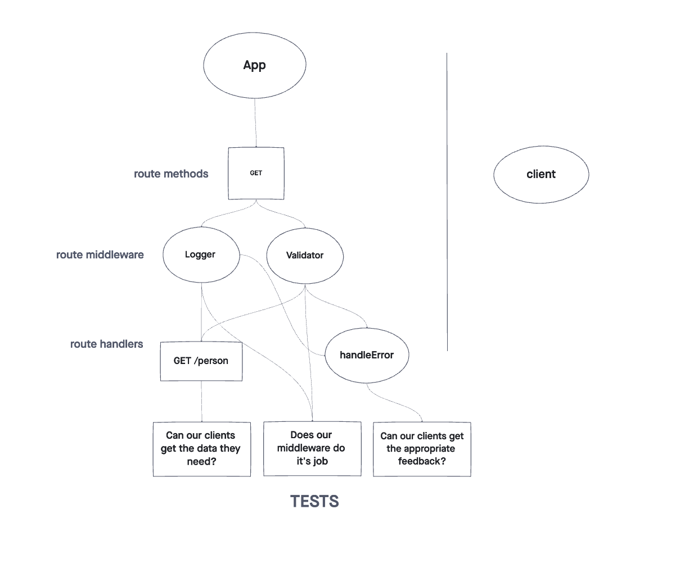

# Basic Express Server

Created by Sarah Creager

## Installation
`npm install`

## Dependencies
 * dotenv
 * express
 * jest
 * supertest
 * Sequelize
 * sqlite3

## Summary of Problem Domain
Built basic express server and deployed to Heroku, includes GET, PUT, DELETE routes, middleware, and tests. Includes 2 SQL data models using the Sequelize libary.

## Links to application deployment

[Deployed Heroku Application](https://sarah-basic-express-server.herokuapp.com/)

[GitHub](https://github.com/SarahCreager/basic-express-server.git)

## UML

## Routes

Method: GET
Path: /food   /restaurant

Method: POST
Path: /food   /restaurant

Method: PUT
Path: /food   /restaurant

Method: DELETE
Path: /food   /restaurant